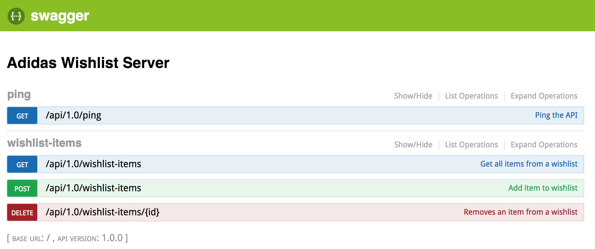

# Adidas Wishlist App
## Overview
The goal is to build an app which enables users to search Adidas products and to create a wishlist of all the articles they want to have. This is an example app that shows SPA communication with RESTful backend. This repository contains both **server** and **client** code.

## Preview
This is how the app looks like in the end:


## Server
Server exposes RESTful API and is built with:
- NodeJS 8.4.0
- HapiJS 16.6.2
- TypeScript 2.6.1

It exposes three major endpoints:
- Create a wishlist item: POST /api/1.0/wishlist-items
- Get all wishlist items: GET /api/1.0/wishlist-items
- Delete a wishlist item: DELETE /api/1.0/wishlist-items

Once you get backend up and running you can access API docs at http://localhost/3030/documentation



**NOTE: Server stores all data in memory, so once server is restarted all wishlist data is lost.**

### Requirements
You can run the app on any machine that has Node 8.4 installed, but recommended way of running the app is with [Docker](https://docs.docker.com/engine/installation/). At the time of writing latest version was 17.09.0.

### Running the Server
Clone the repo
```
$ git clone git@github.com:amirilovic/adidas-wishlist.git
```

Navigate to server folder:
```
$ cd adidas-wishlist/server
```
Copy the configuration file:

```
$ cp .env.example .env
```

Start the server:
```
$ make start
```

First time you run the `make start` command it will do `npm install`, so it will take some time for the server to start. Server will be fully functional when you see line like this:

```
api_1  | {"name":"adidas-wishlist-server","hostname":"9815fc1635d6","pid":189,"level":30,"msg":"server started at port: 3030 with env: development","time":"2017-12-04T07:31:10.613Z","v":0}
```

Server will be up and listening on port `3030`. If you navigate to http://localhost:3030/documentation you should be able to see API documentation mentioned above.

Please not that `make` is used just for convenience to create shortcut commands for `docker-compose`. Here is the full list of make commands you can run from inside `server` folder of the repo:

```
$ make

usage: make COMMAND

Commands:                                                                                                             
  start         Start app with docker-compose
  stop          Stop app
  clean         Clean all containers
  logs          View container logs
  test          Runs all tests
  test-watch    Runs all tests in watch mode
```

For exact commands that are run with make please see `Makefile`.

If you are running the app without Docker:

Install all dependencies
```
$ npm install
```

Start the server
```
$ npm start
```

Run tests
```
$ npm test
```

### Debugging the Server
When run with Docker server exposes port `9229` for debugging, you can use debugger from IDE or Chrome Dev Tools to attach to the server. TypeScript compiler creates source maps, so you should be able to jump straight to TypeScript source code.

If you are using [Visual Studio Code](https://code.visualstudio.com/) for editing debug configuration is in `.vscode/launch.json`. Just open the root of the repo in VS Code, start the server and hit `F5` once server is up, debugger should be attached.

For a complete list of npm script please see `package.json` file.
## Client
Client is a Single Page Application (SPA) built with:
- AngularJS 1.5.0
- AngularJS Material 1.1.5
- Webpack 2.2.0
- Babel

Tested browsers:
- Chrome 62.0
- Firefox 57.0
- Safari 11.0
- Opera 49.0
### Running the Client
Clone the repo:
```
$ git clone git@github.com:amirilovic/adidas-wishlist.git
```

Navigate to client folder:
```
$ cd adidas-wishlist/client
```

Install all dependencies
```
$ npm install
```

Start the development server
```
$ npm start
```

To access the app please navigate browser to: http://localhost:8080/